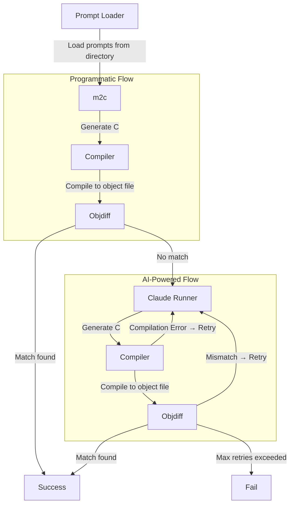

# Mizuchi


> A plugin-based pipeline runner for matching decompilation projects.

Mizuchi automates the cycle of writing C code, compiling, and comparing against a target binary.

It orchestrates a plugin-based pipeline that can leverage programmatic and AI-powered tools to automatically decompile assembly functions to C source code that produces byte-for-byte identical machine code when compiled.

- ✨ Automatic retries with detailed context on compilation or match failures
- 🐍 Integration with [m2c](https://github.com/matt-kempster/m2c) and [objdiff](https://github.com/encounter/objdiff/)
- 📊 Beautiful report UI


<table align="center">
    <tr>
        <td align="center" width="50%">
          <kbd></kbd><br />
          <i>Achieve fully matching code automatically</i>
        </td>
        <td align="center" width="50%">
          <kbd></kbd><br />
          <i>Even partial matches provide a good start</i>
        </td>
    </tr>
</table>

> ⚙️ **What is Matching Decompilation?**
>
> Matching decompilation is the art of converting assembly back into C source code that, when compiled, produces byte-for-byte identical machine code. It's popular in the retro gaming community for recreating source code of classic games. For example, [Super Mario 64](https://github.com/n64decomp/sm64) and [The Legend of Zelda: Ocarina of Time](https://github.com/zeldaret/oot) have been fully match-decompiled.
>
> [Learn more by watching my talk.](https://www.youtube.com/watch?v=sF_Yk0udbZw)

---

> :warning: **Work in Progress**
>
> Mizuchi is currently focused on benchmarking LLM prompt effectiveness, with plans to become a general-purpose decompilation automation tool. Check the [issues tab](https://github.com/macabeus/mizuchi/issues) for planned features.

---

> 🚏 **Mizuchi vs Alternatives**
>
> [**Ralph**](https://github.com/frankbria/ralph-claude-code) is useful for iterating on repetitive tasks with Claude Code. Mizuchi differs by generating detailed reports and offering a plugin architecture for adding custom pipeline steps, with plans to support workflows beyond AI-based approaches.

## Installation

```bash
npm install
npm run build && npm run build:report-ui
```

### m2c Setup (Optional)

To enable the m2c programmatic-flow phase:

```bash
git submodule update --init
./scripts/setup-m2c.sh
```

### Requirements

- `ANTHROPIC_API_KEY` environment variable set

## Quick Start

1. **Create a configuration file**:

```bash
cp mizuchi.example.yaml mizuchi.yaml
```

2. **Set up your prompts**:

Create the prompt directory following this structure:

```txt
prompts/
  my-function-1/
    prompt.md         # The prompt content
    settings.yaml     # Metadata (functionName, targetObjectPath)
  my-function-2/
    prompt.md
    settings.yaml
```

See the [Prompt Folder Structure](#prompt-folder-structure) section for details.

> **Tip**: Use [Kappa](https://github.com/macabeus/kappa) to generate rich prompts automatically.

3. **Run the benchmark**:

```bash
npm start
```

## Prompt Folder Structure

Each prompt is a folder containing two files. See the [`prompts/`](prompts/) directory for examples.

### `prompt.md`

The prompt sent to Claude. Should include:

- A request to decompile an assembly function to C
- The assembly code to decompile

### `settings.yaml`

Metadata for the prompt:

```yaml
functionName: my_function
targetObjectPath: /path/to/build/code.o
asm: |
  .text
  glabel my_function
      push {lr}
      bx lr
```

## Pipeline Overview

Mizuchi executes a sequential pipeline of plugins:



> 📌 **Roadmap**: Future plans include support for [decomp-permuter](https://github.com/simonlindholm/decomp-permuter) and automatic code insertion into the codebase. See the [issues tab](https://github.com/macabeus/mizuchi/issues) for planned features.

## Output

Mizuchi generates three output files:

| File                                 | Description                                                                          |
| ------------------------------------ | ------------------------------------------------------------------------------------ |
| `benchmark-results-{timestamp}.json` | Complete execution data including plugin results, timing, and success/failure status |
| `benchmark-report-{timestamp}.html`  | Visual report with success rates, metrics, and per-prompt breakdown                  |
| `claude-cache.json`                  | Cached Claude API responses keyed by prompt content hash                             |

### Built-in Plugins

| Plugin            | Description                                                                                          |
| ----------------- | ---------------------------------------------------------------------------------------------------- |
| **m2c**           | Optional: generates an initial C decompilation using [m2c](https://github.com/matt-kempster/m2c)     |
| **Claude Runner** | Sends prompts to Claude and processes responses                                                      |
| **Compiler**      | Compiles generated C code using a configurable shell script template                                 |
| **Objdiff**       | Compares compiled object files against targets using [objdiff](https://github.com/encounter/objdiff) |

## Development

```bash
# Install dependencies
npm install

# Run tests
npm test

# Run tests in watch mode
npm run test:watch

# Type checking
npm run check-types

# Linting
npm run lint

# Format code
npm run format

# Run in development mode
npm run dev

# Run the report UI in development mode
npm run dev:report-ui -- ./benchmark-results-[timestamp].json
```
