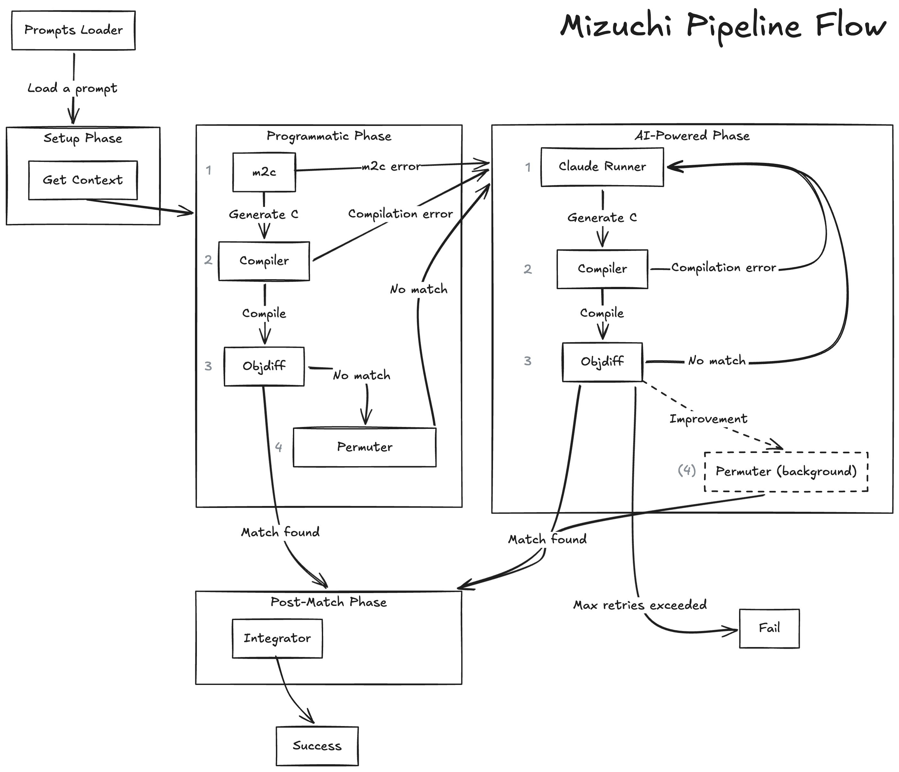

# Mizuchi


> 🐉 Forge C from the ashes of assembly. What the compiler consumed, the dragon returns.

Mizuchi automates the cycle of writing C code, compiling, and comparing against a target binary, towards the goal of fully automatic **matching decompilation**.

It orchestrates a plugin-based pipeline that can leverage programmatic and AI-powered tools to automatically decompile assembly functions to C source code that produces byte-for-byte identical machine code when compiled.

- ✨ Automatic retries with detailed context on compilation or match failures
- 🐍 Integration with Claude, [m2c](https://github.com/matt-kempster/m2c), [decomp-permuter](https://github.com/simonlindholm/decomp-permuter), and [objdiff](https://github.com/encounter/objdiff/).
- 🗺️ Decomp Atlas, a powerful webapp to browse functions and generate rich prompts in one click
- 📊 Beautiful Report UI to visualize the pipeline result

> [📚 Learn about this project and its benchmarks on this post](https://gambiconf.substack.com/p/can-llms-really-do-matching-decompilation)


<table align="center">
    <tr>
      <td align="center" width="50%">
        <kbd></kbd><br />
        <i>Achieve fully matching code automatically</i>
      </td>
      <td align="center" width="50%">
        <kbd></kbd><br />
        <i>Even partial matches provide a good start</i>
      </td>
    </tr>
</table>

<table align="center">
    <tr>
      <td align="center" width="33%">
        <kbd></kbd><br />
        <i>Explore the function cloud by similarity</i>
      </td>
      <td align="center" width="33%">
        <kbd></kbd><br />
        <i>Pick your next function to decompile based on scoring</i>
      </td>
      <td align="center" width="33%">
        <kbd></kbd><br />
        <i>Build rich prompts to decompile a function in a single click</i>
      </td>
    </tr>
</table>

> ⚙️ **What is Matching Decompilation?**
>
> Matching decompilation is the art of converting assembly back into C source code that, when compiled, produces byte-for-byte identical machine code. It’s popular in the retro gaming community for recreating the source code of classic games. For example, [Super Mario 64](https://github.com/n64decomp/sm64) and [The Legend of Zelda: Ocarina of Time](https://github.com/zeldaret/oot) have been fully match-decompiled.
>
> [Learn more by watching my talk.](https://www.youtube.com/watch?v=sF_Yk0udbZw)

## Installation

```bash
npm install
npm run build && npm run build:ui
```

### m2c Setup (Optional)

To enable the m2c programmatic phase:

```bash
git submodule update --init vendor/m2c
./scripts/setup-m2c.sh
```

### decomp-permuter Setup (Optional)

To enable decomp-permuter (brute-force mutation matching). Works both in the programmatic phase and as background tasks during the AI-powered phase:

```bash
git submodule update --init vendor/decomp-permuter
./scripts/setup-decomp-permuter.sh
```

### Requirements

- `ANTHROPIC_API_KEY` environment variable set or login on Claude Code to cache credentials locally

## Quick Start

1. **Create a configuration file**: Copy the example config and customize it for your project.

```bash
cp mizuchi.example.yaml /path/to/you/decomp/project/mizuchi.yaml
```

2. **Index your codebase**:

```bash
npm start -- index-codebase --config /path/to/your/decomp/project/mizuchi.yaml
```

3. **Start the Decomp Atlas server**:

```bash
npm start -- atlas --config /path/to/your/decomp/project/mizuchi.yaml
```

4. **Generate prompts**: Open Decomp Atlas at [`http://localhost:3000/`](http://localhost:3000/), browse the functions and generate the prompts

5. **Run the pipelines**:

```bash
npm start -- run --config /path/to/your/decomp/project/mizuchi.yaml
```

## Pipeline Overview

Mizuchi executes a pipeline of plugins:



> 📌 **Roadmap**: See the [issues tab](https://github.com/macabeus/mizuchi/issues) for planned features.

## Output

Mizuchi generates three output files:

| File                           | Description                                                                          |
| ------------------------------ | ------------------------------------------------------------------------------------ |
| `run-results-{timestamp}.json` | Complete execution data including plugin results, timing, and success/failure status |
| `run-report-{timestamp}.html`  | Visual report with success rates, metrics, and per-prompt breakdown                  |
| `claude-cache.json`            | Cached Claude API responses keyed by prompt content hash                             |

### Built-in Plugins

| Plugin              | Description                                                                                                                             |
| ------------------- | --------------------------------------------------------------------------------------------------------------------------------------- |
| **m2c**             | Optional: generates an initial C decompilation using [m2c](https://github.com/matt-kempster/m2c)                                        |
| **decomp-permuter** | Optional: brute-forces code mutations using [decomp-permuter](https://github.com/simonlindholm/decomp-permuter) to improve match scores |
| **Claude Runner**   | Sends prompts to Claude and processes responses                                                                                         |
| **Compiler**        | Compiles generated C code using a configurable shell script template                                                                    |
| **Objdiff**         | Compares compiled object files against targets using [objdiff](https://github.com/encounter/objdiff)                                    |

## Decomp Atlas

Decomp Atlas is a web UI for exploring your decompilation project and target the next functions to decompile. It includes a **prompt builder** that generates rich decompilation prompts.

### Starting the server

```bash
# Build the CLI and UI
npm run build && npm run build:decomp-atlas

# Start the Decomp Atlas server
npm start -- atlas --config mizuchi.yaml
```

The server reads your `mizuchi.yaml` config and serves the Decomp Atlas UI at `http://localhost:3000`.

> Note: Your project must have a `mizuchi-db.json` file in the root directory for the Decomp Atlas to work. Generate it with `mizuchi index-codebase` (see below).

### Indexing Your Codebase

The `index-codebase` command scans your decompilation project and generates a `mizuchi-db.json` file containing all discovered functions, their assembly, C source (if decompiled), call graphs, and vector embeddings.

**1. Configure your `mizuchi.yaml`:**

Add `nonMatchingAsmFolders` to the `global` section listing directories that contain non-matching assembly files (relative to `projectPath`):

```yaml
global:
  projectPath: /path/to/decomp/project
  mapFilePath: /path/to/project.map
  target: gba # or n64, ps1, etc.
  nonMatchingAsmFolders:
    - asm/non_matching
    - asm
```

**2. Run the indexer:**

```bash
# Build first (if not already done)
npm run build

# Index the codebase
npm start -- index-codebase --config mizuchi.yaml

# Or in development mode
npm run dev -- index-codebase --config mizuchi.yaml
```

The indexer performs three phases:

1. **Scan matched functions** — finds C function definitions via ast-grep, resolves each to its compiled `.o` file using the map file, and extracts assembly via objdiff
2. **Scan unmatched functions** — reads `.s`/`.S`/`.asm` files from `nonMatchingAsmFolders` and parses function boundaries
3. **Compute embeddings** — generates vector embeddings using [jina-embeddings-v2-base-code](https://huggingface.co/jinaai/jina-embeddings-v2-base-code) via a Python subprocess with MPS GPU acceleration (Apple Silicon) or CPU fallback

**Options:**

| Flag                    | Description                                              |
| ----------------------- | -------------------------------------------------------- |
| `-c, --config`          | Path to `mizuchi.yaml` (defaults to `./mizuchi.yaml`)    |
| `-s, --skip-embeddings` | Skip embedding generation (useful for quick re-indexing) |

**Incremental indexing:** Re-running the command only recomputes embeddings for new or changed functions. Unchanged functions preserve their existing embeddings.

**Python requirements for embeddings:** Python 3.10+ is required. On first run, the indexer automatically creates a virtual environment at `~/.cache/mizuchi/python-venv/` and installs `torch` and `transformers` (~2-3 GB). The model weights are cached at `~/.cache/huggingface/`. Use `--skip-embeddings` to skip this entirely.

## Development

See [DEVELOPMENT.md](DEVELOPMENT.md) for development setup, commands, and notes.
